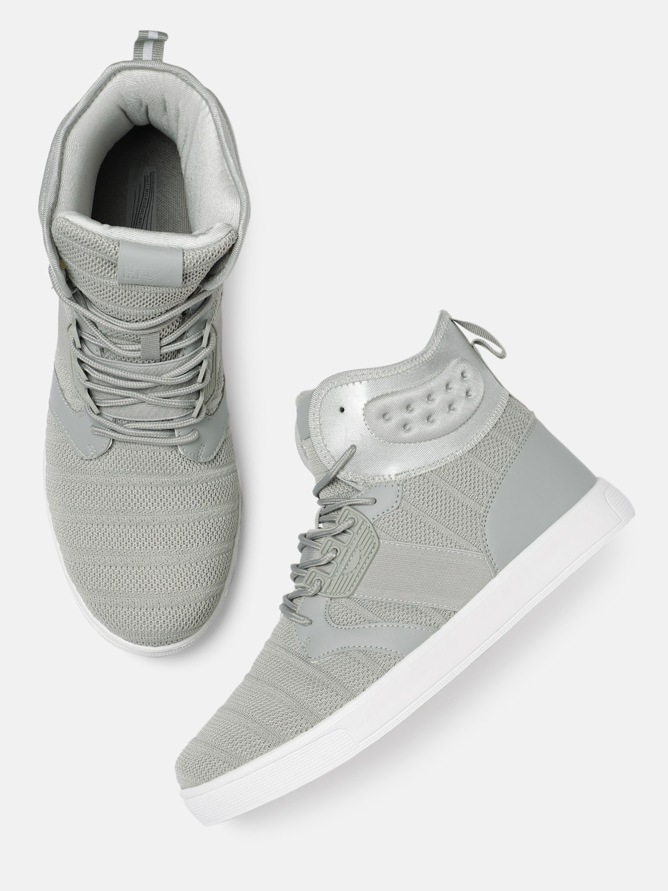

# 🛍️ RedStore — Workout & Fitness E-Commerce Website

**A professional, responsive e-commerce frontend built with HTML5, CSS3, and Bootstrap 5 — showcasing clean markup, semantic structure, and polished UI design.**

---

## 📋 Table of Contents

- [Overview](#overview)
- [Features](#features)
- [Tech Stack](#tech-stack)
- [Project Structure](#project-structure)
- [Files Overview](#files-overview)
- [Installation](#installation)
- [Running Locally](#running-locally)
- [Features Explained](#features-explained)
- [Responsive Design](#responsive-design)
- [Browser Compatibility](#browser-compatibility)
- [Customization](#customization)
- [Assets](#assets)
- [Performance](#performance)
- [Accessibility](#accessibility)
- [SEO Considerations](#seo-considerations)
- [Future Enhancements](#future-enhancements)
- [Screenshots / Preview](#screenshots--preview)
- [Contributing](#contributing)
- [License](#license)
- [Support & Contact](#support--contact)

---

## Overview

**RedStore** is a fully static, front-end e-commerce website focused on workout and fitness apparel. The project demonstrates:

- **Clean, semantic HTML5** structure with well-organised sections
- **CSS3 styling** using Flexbox, transitions, hover effects, and radial gradients
- **Bootstrap 5** grid and component integration
- **Font Awesome** icon usage for star ratings and UI icons
- A complete **multi-section landing page** — navigation, hero banner, product listings, offer spotlight, testimonials, brand showcase, and a four-column footer

The project is ideal as a portfolio piece to showcase front-end development skills, or as a starting template for a real fitness e-commerce store.

---

## Features

- ✅ **Semantic HTML5** — logical, readable document structure
- 🎨 **Professional CSS3 styling** — gradients, transitions, hover animations, and custom color scheme
- 📱 **Responsive layout** — Flexbox with `flex-wrap` ensures content reflows gracefully across screen sizes
- 🖼️ **Rich image assets** — product cards, category banners, user avatars, brand logos, and app-store badges
- 🛒 **Navigation bar** — logo, menu links, and shopping cart icon
- ⭐ **Star ratings** — Font Awesome icons for product and testimonial ratings
- 📣 **Exclusive offer banner** — full-width promotional section for featured products
- 💬 **Testimonials section** — customer review cards with box-shadow lift animation
- 🏷️ **Brand logos row** — grayscale-to-color hover effect on brand images
- 📲 **Footer with app download links** — App Store and Play Store badges, social media links, and useful quick links

---

## Tech Stack

| Technology | Version | Purpose |
|---|---|---|
| HTML5 | — | Page structure and semantics |
| CSS3 | — | Styling, layout, animations |
| Bootstrap | 5.3.1 | Responsive grid and base styles |
| Font Awesome | 6 (kit) | Icons — stars, quotes |
| Google Fonts | — | Open Sans typeface |

> **No JavaScript framework or build tool is required.** The project runs directly in any modern browser.

---

## Project Structure

```
htmlproject/
├── Project.html          # Main HTML file — the entire website
├── style.css             # Custom CSS stylesheet
└── images/               # All image assets
    ├── logo.png              # Header logo (colored)
    ├── logo-white.png        # Footer logo (white)
    ├── image1.png            # Hero section product image
    ├── exclusive.png         # Exclusive offer section image
    ├── cart.png              # Shopping cart icon
    ├── menu.png              # Mobile menu icon
    ├── category-1.jpg        # Featured category image 1
    ├── category-2.jpg        # Featured category image 2
    ├── category-3.jpg        # Featured category image 3
    ├── product-1.jpg         # Product card images (1–12)
    ├── product-2.jpg
    ├── ...
    ├── product-12.jpg
    ├── buy-1.jpg             # Promotional buy images (1–3)
    ├── buy-2.jpg
    ├── buy-3.jpg
    ├── gallery-1.jpg         # Gallery images (1–4)
    ├── gallery-2.jpg
    ├── gallery-3.jpg
    ├── gallery-4.jpg
    ├── user-1.png            # Testimonial user avatars (1–3)
    ├── user-2.png
    ├── user-3.png
    ├── logo-coca-cola.png    # Brand logo images
    ├── logo-godrej.png
    ├── logo-oppo.png
    ├── logo-paypal.png
    ├── logo-philips.png
    ├── app-store.png         # iOS App Store badge
    ├── play-store.png        # Google Play Store badge
    └── img-credit.txt        # Image attribution credits
```

---

## Files Overview

### `Project.html`
The single HTML file that contains the entire website. It is structured into clearly commented sections:

| Section | Description |
|---|---|
| `<head>` | Meta tags, Bootstrap CSS, Google Fonts, Font Awesome script |
| `.header` | Navigation bar + hero banner |
| Featured Categories | Three category card images |
| Featured Products | Four product cards (products 1–4) |
| Latest Products | Eight product cards (products 5–12) |
| Offer | Exclusive product spotlight banner |
| Testimonials | Three customer review cards |
| Brands | Five brand logos with hover color effect |
| Footer | App download, logo, useful links, social links |

### `style.css`
All custom styles for the project. Key style blocks:

| Style Block | Purpose |
|---|---|
| `*` reset | Removes default margins, padding; sets `box-sizing: border-box` |
| `.navbar` | Flexbox navigation bar |
| `.header` | Radial gradient hero background |
| `.small-container` | Centred content wrapper (`max-width: 1080px`) |
| `.col-3`, `.col-4`, `.col-5` | Responsive flex columns for categories, products, and brands |
| `.col-3:hover`, `.col-4:hover` | Vertical lift animation on hover |
| `.title::after` | Red underline accent using `::after` pseudo-element |
| `.rating` | Yellow star color using Font Awesome |
| `.offer` | Radial gradient offer section |
| `.testimonial .col-3` | Card shadow and hover lift for testimonials |
| `.col-5 img` | Grayscale brand logos that colorize on hover |
| `.footer` | Black footer with white text |

### `images/`
Contains all static image assets used throughout the website (see [Project Structure](#project-structure) for a full list). Image credits are documented in `images/img-credit.txt`.

---

## Installation

No build tools or package managers are required. Simply clone the repository:

```bash
git clone https://github.com/KUNALM17/htmlproject.git
cd htmlproject
```

---

## Running Locally

Open `Project.html` directly in your browser:

**Option 1 — File Explorer:**
Double-click `Project.html` in your file explorer.

**Option 2 — Terminal (macOS / Linux):**
```bash
open Project.html
```

**Option 3 — Terminal (Windows):**
```bash
start Project.html
```

**Option 4 — VS Code Live Server (recommended for development):**
1. Install the [Live Server extension](https://marketplace.visualstudio.com/items?itemName=ritwickdey.LiveServer) in VS Code.
2. Right-click `Project.html` → **Open with Live Server**.
3. The browser opens at `http://127.0.0.1:5500/Project.html` with live reload on save.

> **Internet connection required** — Bootstrap, Font Awesome, and Google Fonts are loaded from CDN.

---

## Features Explained

### HTML Structure
The page uses semantic, well-commented HTML sections:

```html
<!-- Navigation + Hero -->
<div class="header">
  <div class="navbar"> ... </div>
  <div class="row"> ... </div>
</div>

<!-- Featured Categories -->
<h2 class="title">Featured Categories</h2>
<div class="categories"> ... </div>

<!-- Products, Offer, Testimonials, Brands, Footer ... -->
```

### Styling Approach
- **CSS reset** at the top ensures consistent cross-browser baseline.
- **Flexbox** is used for all multi-column layouts (`display: flex`, `flex-wrap: wrap`).
- **Radial gradients** create the soft pink hero and offer backgrounds.
- **Transitions** (`transition: 0.5s`) produce smooth hover animations.
- **Pseudo-element** `::after` adds the red accent underline to section titles.
- The **`small-container`** class (`max-width: 1080px; margin: auto`) centres all main content.

### Layout Design
The page uses a series of column helper classes:

| Class | Flex Basis | Use |
|---|---|---|
| `.col1` | 50% | Two-column hero layout |
| `.col-2` | 50% | Two-column offer section |
| `.col-3` | 30% | Three-column categories and testimonials |
| `.col-4` | 25% | Four-column product grid |
| `.col-5` | 160 px fixed | Five-column brand logos row |
| `.footer-col-4` | 25% | Four-column footer |

### Component Breakdown

**Navbar**
Logo on the left; navigation links (`Home`, `Product`, `About`, `Contact`, `Account`, cart icon) aligned right using `nav { flex: 1; text-align: right; }`.

**Hero Banner**
Full-width section with a heading, sub-text, a yellow CTA button, and a product image.

**Product Cards**
Each card contains a product image, product name (`<h4>`), star rating (Font Awesome), and price. Cards animate upward on hover.

**Offer Section**
Full-width promotional banner with a product image on the left, copy on the right, and a "Buy Now" CTA button.

**Testimonials**
Cards with a Font Awesome quote icon, review text, star rating, user avatar, and reviewer name — displayed with a box-shadow that lifts further on hover.

**Brand Logos**
Logos are displayed in grayscale (`filter: grayscale(100%)`) and transition to full color on hover (`filter: grayscale(0)`).

**Footer**
Four-column layout on a black background:
1. App download section with store badges
2. Brand logo and tagline
3. Useful links list
4. Social media links

---

## Responsive Design

The layout uses **CSS Flexbox with `flex-wrap: wrap`** and `min-width` properties, allowing columns to stack naturally on smaller screens:

| Column | `min-width` | Behaviour on small screens |
|---|---|---|
| `.col-3` | 245 px | Wraps to a single column below ~768 px |
| `.col-4` | 200 px | Wraps to two or one columns on mobile |
| `.col-5` | 160 px fixed | Wraps brand logos into multiple rows |

> For full media-query based responsiveness (mobile menu toggle, explicit breakpoints), see [Future Enhancements](#future-enhancements).

---

## Browser Compatibility

Tested and compatible with:

| Browser | Version |
|---|---|
| Google Chrome | Latest |
| Mozilla Firefox | Latest |
| Microsoft Edge | Latest |
| Safari | Latest |
| Opera | Latest |

> **Note:** Internet Explorer is not supported. Flexbox and CSS3 features require a modern browser.

---

## Customization

### Change Content Text
Edit the relevant section directly in `Project.html`. For example, update the hero heading:

```html
<!-- Before -->
<h1>Give Your Workout<br>A New Style!</h1>

<!-- After -->
<h1>Shop the Latest<br>Activewear Collection!</h1>
```

### Change Colours
Update the color variables in `style.css`:

```css
/* Primary accent color (red/orange buttons, title underlines) */
.title::after { background: #ff523b; }
a.btn { background-color: rgb(221, 255, 0); }
a.btn:hover { background-color: orange; }

/* Hero background */
.header { background: radial-gradient(#fff, #ffd6d6); }
```

### Change Fonts
Replace the Google Fonts link in `Project.html` `<head>`:

```html
<!-- Current font: Open Sans -->
<link href="https://fonts.googleapis.com/css2?family=Open+Sans:...&display=swap" rel="stylesheet">
```

Then update `style.css`:

```css
body { font-family: 'Your New Font', sans-serif; }
```

### Replace Images
Drop replacement images into the `images/` folder using the same filenames, or update the `src` attributes in `Project.html`.

---

## Assets

All image assets are located in the `images/` directory. Attribution is documented in `images/img-credit.txt`:

```
Banner: freepik — www.freepik.com
Products: www.myntra.com
```

> If you re-use or distribute this project, ensure compliance with the original image licences.

---

## Performance

Tips to optimize page load performance:

1. **Compress images** — Use tools like [Squoosh](https://squoosh.app/) or [TinyPNG](https://tinypng.com/) to reduce image file sizes.
2. **Convert images to WebP** — Replace `.jpg`/`.png` assets with `.webp` for better compression.
3. **Add `loading="lazy"`** to below-the-fold images:
   ```html
   
   ```
4. **Self-host fonts** — Download Google Fonts and Font Awesome to eliminate external CDN round trips.
5. **Minify CSS** — Use a minifier such as [CSS Minifier](https://cssminifier.com/) before deploying.

---

## Accessibility

Current accessibility features:

- `lang="en"` attribute on `<html>` for screen reader language detection.
- `alt` attributes present on most images (extend to all for full compliance).
- `<meta charset="UTF-8">` and `<meta name="viewport">` for correct rendering.

**Recommended improvements:**

- Add descriptive `alt` text to all images (e.g., `alt="Red printed workout t-shirt"`).
- Use `<button>` elements instead of `<a>` for non-navigational actions like "Buy Now".
- Ensure sufficient color contrast ratios (WCAG 2.1 AA: minimum 4.5:1 for normal text).
- Add `aria-label` to the cart icon link.
- Provide visible focus styles for keyboard navigation.

---

## SEO Considerations

Current SEO setup:

- `<meta charset="UTF-8">` and `<meta name="viewport">` present.
- Semantic heading hierarchy (`<h1>`, `<h2>`, `<h3>`, `<h4>`).

**Recommended improvements:**

```html
<!-- Add inside <head> in Project.html -->
<title>RedStore — Workout & Fitness Apparel</title>
<meta name="description" content="Shop the latest workout and fitness apparel at RedStore. Featured categories, top-rated products, and exclusive deals.">
<meta name="keywords" content="workout, fitness, apparel, t-shirts, e-commerce">
<meta property="og:title" content="RedStore — Workout & Fitness Apparel">
<meta property="og:description" content="Shop workout and fitness apparel at RedStore.">
<meta property="og:image" content="images/logo.png">
```

---

## Future Enhancements

- [ ] **JavaScript interactivity** — add-to-cart functionality, quantity selector, dynamic product filtering
- [ ] **Responsive navigation** — hamburger menu for mobile using `menu.png`
- [ ] **Product detail pages** — dedicated page for each product with full description
- [ ] **Shopping cart page** — cart summary, quantity controls, checkout flow
- [ ] **Search functionality** — product search bar in the navbar
- [ ] **CSS custom properties (variables)** — centralize colors and spacing for easier theming
- [ ] **Dark mode** — `prefers-color-scheme` media query support
- [ ] **Explicit media queries** — defined breakpoints for tablet and mobile layouts
- [ ] **Gallery section** — showcase the `gallery-1.jpg` through `gallery-4.jpg` assets
- [ ] **Offers / Buy pages** — make use of `buy-1.jpg` through `buy-3.jpg` assets

---

## Screenshots / Preview

> The screenshots below represent the key sections of the website.

| Section | Description |
|---|---|
| **Hero Banner** | Full-width header with gradient background, headline, CTA button, and product image |
| **Featured Categories** | Three-column image cards for product categories |
| **Product Grid** | Four-column product cards with name, star rating, and price |
| **Exclusive Offer** | Pink gradient promotional banner with "Buy Now" CTA |
| **Testimonials** | Three review cards with user avatars and star ratings |
| **Brand Logos** | Grayscale brand logos that reveal color on hover |
| **Footer** | Dark four-column footer with app badges and social links |

---

## Contributing

Contributions are welcome! To contribute:

1. **Fork** this repository.
2. **Create a feature branch:**
   ```bash
   git checkout -b feature/your-feature-name
   ```
3. **Make your changes** — follow the existing code style and keep HTML semantic and CSS well-organised.
4. **Commit with a clear message:**
   ```bash
   git commit -m "Add: description of your change"
   ```
5. **Push to your fork:**
   ```bash
   git push origin feature/your-feature-name
   ```
6. **Open a Pull Request** against the `main` branch of this repository.

Please ensure:
- All images have descriptive `alt` attributes.
- No inline styles are added (use `style.css`).
- New sections follow the existing HTML commenting pattern.

---

## License

This project is licensed under the **MIT License**.

```
MIT License

Copyright (c) 2026 Kunal M

Permission is hereby granted, free of charge, to any person obtaining a copy
of this software and associated documentation files (the "Software"), to deal
in the Software without restriction, including without limitation the rights
to use, copy, modify, merge, publish, distribute, sublicense, and/or sell
copies of the Software, and to permit persons to whom the Software is
furnished to do so, subject to the following conditions:

The above copyright notice and this permission notice shall be included in all
copies or substantial portions of the Software.

THE SOFTWARE IS PROVIDED "AS IS", WITHOUT WARRANTY OF ANY KIND, EXPRESS OR
IMPLIED, INCLUDING BUT NOT LIMITED TO THE WARRANTIES OF MERCHANTABILITY,
FITNESS FOR A PARTICULAR PURPOSE AND NONINFRINGEMENT. IN NO EVENT SHALL THE
AUTHORS OR COPYRIGHT HOLDERS BE LIABLE FOR ANY CLAIM, DAMAGES OR OTHER
LIABILITY, WHETHER IN AN ACTION OF CONTRACT, TORT OR OTHERWISE, ARISING FROM,
OUT OF OR IN CONNECTION WITH THE SOFTWARE OR THE USE OR OTHER DEALINGS IN
THE SOFTWARE.
```

---

## Support & Contact

- 🐛 **Issues:** [GitHub Issues](https://github.com/KUNALM17/htmlproject/issues)
- 💬 **Discussions:** [GitHub Discussions](https://github.com/KUNALM17/htmlproject/discussions)
- 📧 **Email:** Available via [GitHub profile](https://github.com/KUNALM17)

---

<p align="center">
  Made with ❤️ by <a href="https://github.com/KUNALM17">Kunal M</a>
</p>
